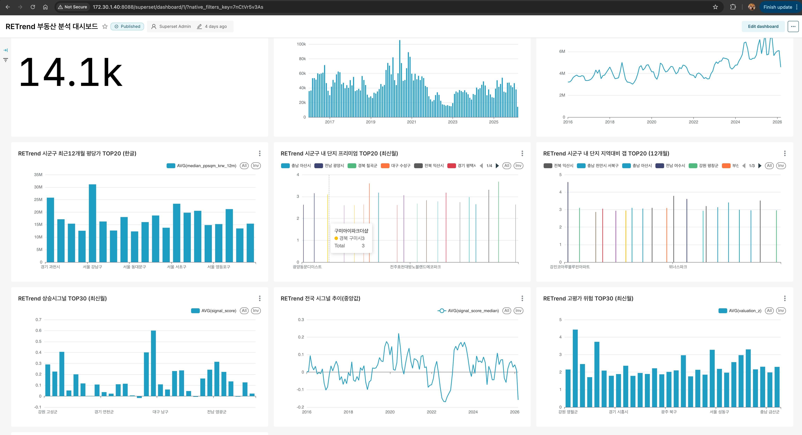
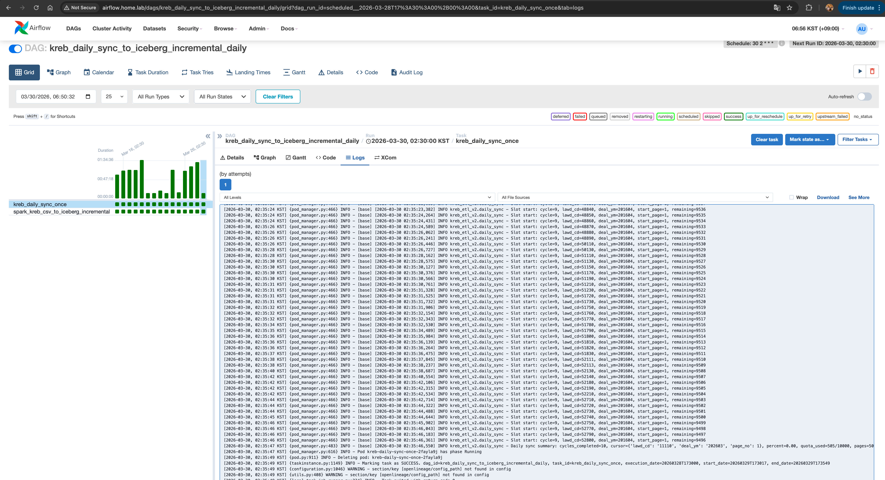
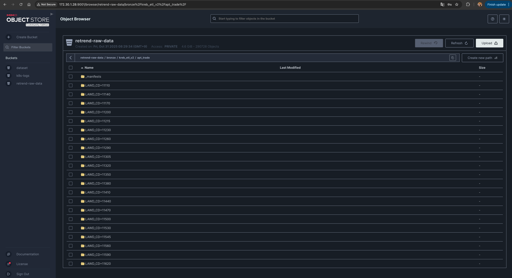
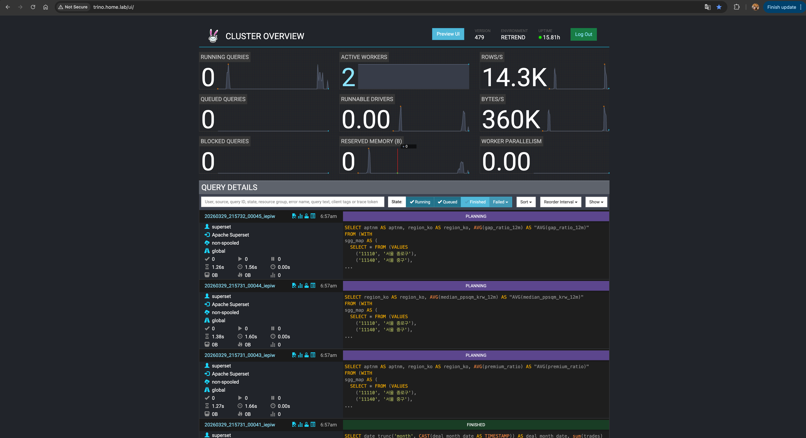
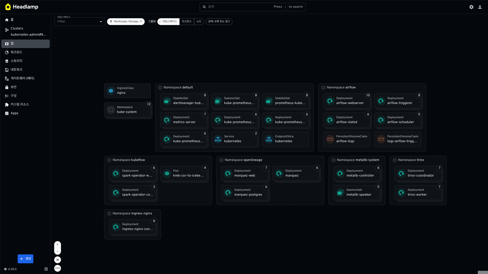

# RETrend

RETrend는 **국토부 실거래가 데이터를 수집/정제**하고, 이를 **Iceberg 기반 레이크하우스**로 적재해 분석까지 연결하는 데이터 파이프라인 프로젝트입니다.  
현재 운영 흐름은 Airflow(KubernetesExecutor) + Spark on Kubernetes + Trino 조합을 기준으로 관리합니다.



---

## What This Repository Covers

- KREB API 기반 원천 데이터 수집(백필/증분)
- Airflow DAG 오케스트레이션

- Spark 기반 Bronze -> Iceberg 적재

- Trino 조회 계층 구성

- 운영 배포(Helm/Kubernetes) 및 점검 커맨드

---

## Architecture (Current)

1. **Ingestion (Bronze)**
   - `src/kreb/src/kreb_etl_v2/backfill.py`
   - `src/kreb/src/kreb_etl_v2/daily_sync.py`
   - 출력: MinIO/S3 prefix (`s3://retrend-raw-data/bronze/...`)

2. **Orchestration (Airflow)**
   - DAG 정의: `dags/`
   - 운영 배포: `helm/airflow/airflow-onprem.yaml`

3. **Processing (Spark)**
   - 엔트리포인트: `jobs/spark/`
   - SparkApplication 매니페스트: `infra/spark/k8s/`

4. **Query (Trino)**
   - 배포 값/Ingress: `infra/trino/k8s/`

---

## Repository Guide (Active Paths)

| Path | Purpose |
|---|---|
| `dags/` | Airflow DAG 정의 |
| `src/kreb/` | KREB ETL 파이썬 패키지 및 테스트 |
| `jobs/` | 사람이 직접 실행하는 엔트리포인트 |
| `infra/spark/k8s/` | SparkApplication YAML |
| `infra/trino/k8s/` | Trino Helm values + Ingress |
| `helm/airflow/` | Airflow Helm values |
| `helm/nginx/` | Airflow Ingress 매니페스트 |
| `helm/metrics-server/` | metrics-server 운영 값 |
| `commands.md` | 운영 커맨드 모음 |
| `docs/platform_runbook.md` | 운영 기준(runbook) |

> 참고: `docs/history/`는 과거 실험/백업 코드입니다. 신규 운영 기준으로는 사용하지 않습니다.

---

## Quick Start (Local)

### Prerequisites

- Python 3.9+
- Docker / kubectl / Helm
- (선택) MinIO 또는 S3 접근 권한

### 1) Python 환경 준비

```bash
python3 -m venv .venv
source .venv/bin/activate
pip install -e "src/kreb[dev]"
```

### 2) 로컬 백필 실행

```bash
export KREB_SERVICE_KEY=...
export KREB_DAILY_LIMIT=10000
export KREB_LAWD_CSV=/path/to/lawd.csv
export KREB_STATE_URI=file:///tmp/kreb_state.json
export KREB_OUTPUT_URI=file:///tmp/kreb_output

python src/kreb/src/kreb_etl_v2/backfill.py
```

### 3) 테스트

```bash
python -m pytest -q src/kreb/tests
```

---

## Kubernetes Deployment (Core)

### Airflow

```bash
helm repo add apache-airflow https://airflow.apache.org
helm repo update

helm upgrade --install airflow apache-airflow/airflow \
  --namespace airflow \
  --create-namespace \
  -f helm/airflow/airflow-onprem.yaml
```

### Airflow Ingress

```bash
kubectl apply -f helm/nginx/airflow-ingress-manual.yaml
```

### metrics-server

```bash
helm repo add metrics-server https://kubernetes-sigs.github.io/metrics-server/
helm repo update

helm upgrade --install metrics-server metrics-server/metrics-server \
  -n default \
  -f helm/metrics-server/values-onprem.yaml
```

---

## Important Operational Notes

### 1) Airflow DAG Source of Truth

Airflow는 `gitSync`를 사용하며 DAG를 외부 저장소에서 가져옵니다.

- repo: `https://github.com/Seungyeup/RETrend.git`
- branch: `main`
- subPath: `dags`

다른 repository DAG를 함께 보려면 `dags/` 하위에 git submodule로 연결하고,
`dags.gitSync.env.GITSYNC_SUBMODULES=recursive`를 유지합니다.
이 경우 배포되는 DAG 버전은 submodule SHA에 고정되며, 다른 repo 변경 반영 시 RETrend에서 submodule 포인터 업데이트 커밋이 필요합니다.

즉, 이 저장소의 `dags/` 변경만으로는 운영 Airflow에 즉시 반영되지 않을 수 있습니다.

### 2) Task Log Persistence

Airflow는 원격 로그를 사용하도록 구성되어 있습니다(`s3://retrend-raw-data/airflow/logs`).  
배포 후 `aws_default` connection이 없으면 로그 조회가 실패할 수 있으므로 아래 명령으로 생성/갱신합니다.

```bash
kubectl -n airflow exec deploy/airflow-scheduler -- airflow connections delete aws_default || true
kubectl -n airflow exec deploy/airflow-scheduler -- airflow connections add aws_default \
  --conn-json '{"conn_type":"aws","extra":{"aws_access_key_id":"<MINIO_ACCESS_KEY>","aws_secret_access_key":"<MINIO_SECRET_KEY>","endpoint_url":"http://172.30.1.28:9000","region_name":"us-east-1"}}'
```

### 3) OpenLineage Namespace / Dataset Convention

Marquez lineage는 아래를 canonical identity로 사용합니다.

- Bronze data: `s3://retrend-raw-data/bronze/kreb_etl_v2/apt_trade`
- Iceberg table: `iceberg://default/apt_trade`
- Superset virtual datasets: `superset://retrend/virtual_datasets`

운영용 state/manifest 파일(`kreb_state_daily_sync.json`, `_manifests/...`)은 lineage 핵심 데이터셋으로 취급하지 않습니다.
Spark OpenLineage는 `spark.openlineage.dataset.removePath.pattern`으로 파티션 경로(`LAWD_CD=.../DEAL_YM=...`)를 Bronze 루트로 정규화합니다.

---

## Extended Docs

- Platform runbook: `docs/platform_runbook.md`
- Ops command collection: `commands.md`
- Infra details: `infra/README.md`
- Docker image notes: `docker/README.md`
- Jobs entrypoints: `jobs/README.md`

---

## Security

- API 키/DB 비밀번호/Access Key는 Git에 커밋하지 않습니다.
- 운영 환경에서는 Kubernetes Secret, Airflow Connection/Variable로 관리합니다.
- `docs/history/`의 예시 값은 운영 기준으로 재사용하지 않습니다.
