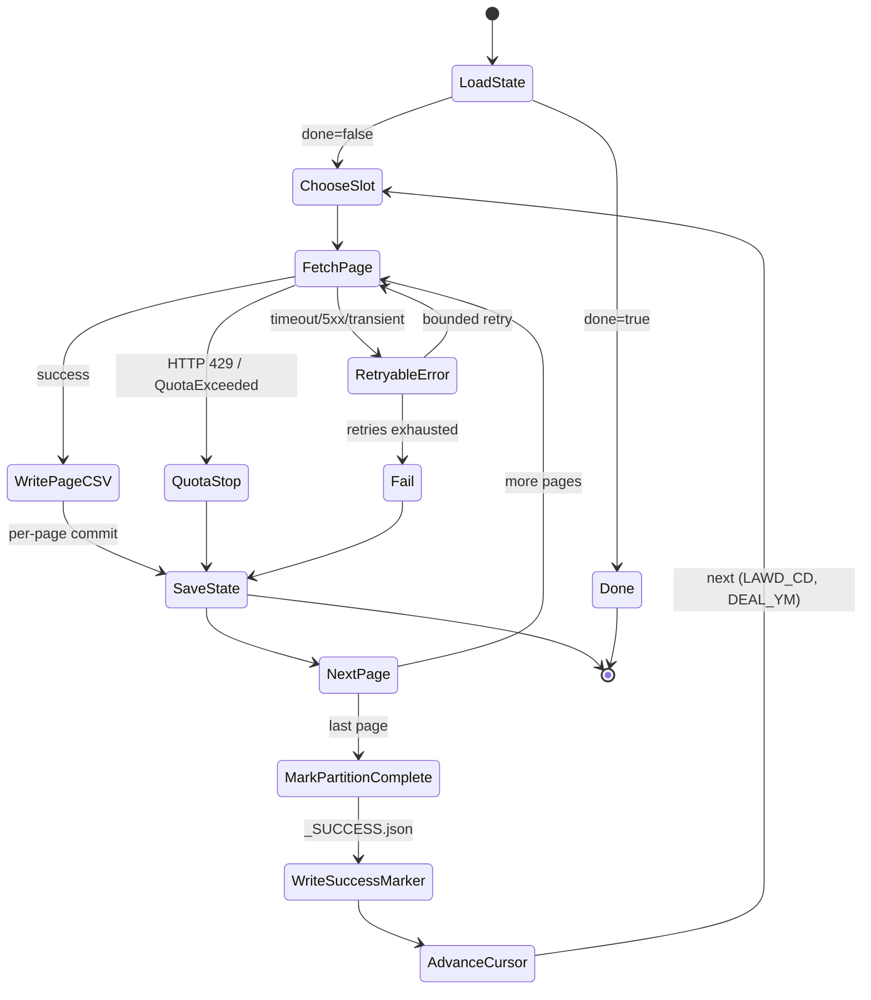
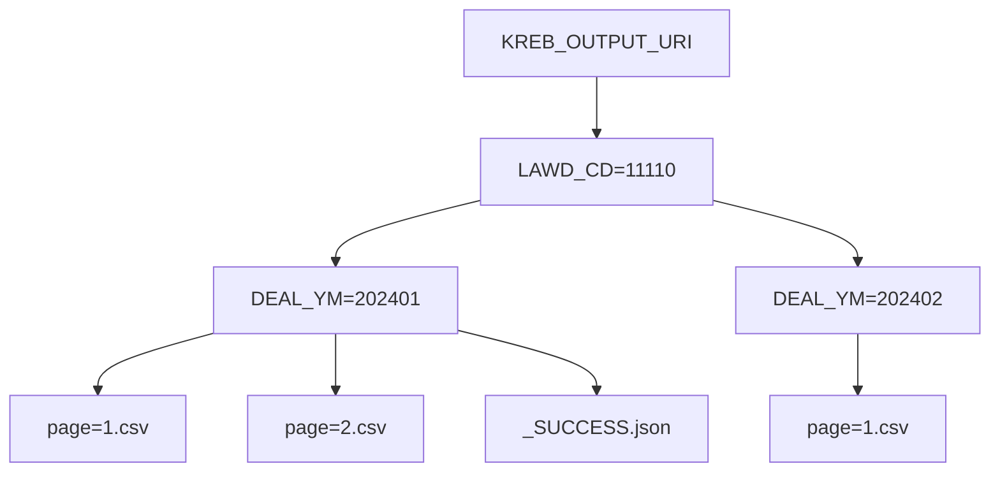
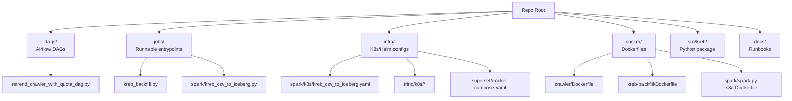

# RETrend Architecture Visuals

이 문서는 RETrend의 현재 구조(수집 → 저장 → 처리 → 쿼리/BI)를 빠르게 이해할 수 있도록 Mermaid 기반 시각자료를 제공합니다.

> GitHub/Markdown 뷰어에서 Mermaid 렌더링이 지원되면 다이어그램이 그대로 보입니다.

## 1) End-to-End 아키텍처

```mermaid
flowchart LR
  subgraph Orchestration[Orchestration]
    AF[Airflow DAG\nKubernetesPodOperator]
  end

  subgraph Ingestion[Ingestion (KREB)]
    JOB[Backfill Job\nPython backfill.py]
    API[KREB Open API\n(Quota limited)]
    STATE[(State JSON\nKREB_STATE_URI)]
  end

  subgraph Storage[Storage]
    BRONZE[(Bronze CSV on MinIO/S3\nKREB_OUTPUT_URI)]
  end

  subgraph Processing[Processing]
    SP[SparkApplication\n(csv -> iceberg)]
    ICE[(Iceberg Table\nwarehouse)]
    HMS[(Hive Metastore)]
  end

  subgraph Serving[Serving]
    TR[Trino]
    BI[Superset]
  end

  AF -->|runs container job| JOB
  JOB -->|HTTP requests| API
  JOB -->|page CSV writes| BRONZE
  JOB -->|cursor/progress writes| STATE

  SP -->|reads| BRONZE
  SP -->|writes| ICE
  SP -->|uses| HMS

  TR -->|queries| ICE
  BI -->|connects| TR
```

## 2) KREB Backfill 상태(State) 흐름



## 3) 브론즈 데이터 레이아웃(파티션/파일)



## 4) 코드/폴더 레이어 맵(현재 기준)


