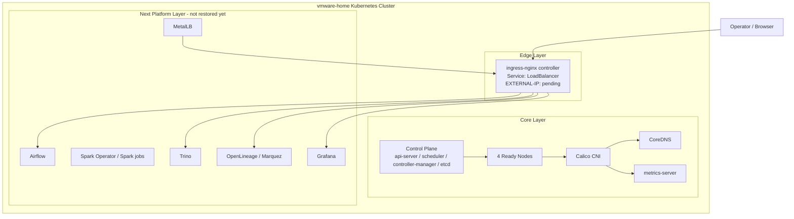
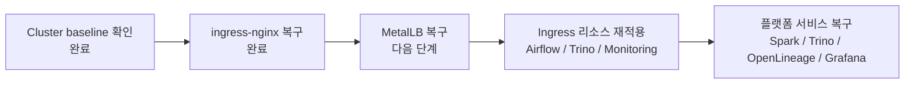

# RETrend Infra Overview

이 문서는 현재 RETrend 인프라 레이어의 **공식 현재 상태 문서**입니다.

`history/` 아래 내용은 참고용 아카이브이며, 앞으로의 인프라 진행 상황은 이 문서를 계속 갱신합니다.

## 현재 검증된 상태

- Kubernetes context: `vmware-home`
- 노드 4대(`k8s-master`, `k8s-worker1`, `k8s-worker2`, `k8s-worker3`) 모두 `Ready`
- `calico-system`, `coredns`, `metrics-server` 정상 동작
- `ingress-nginx` 설치 완료
- `ingress-nginx-controller` 파드 `Ready`
- `ingress-nginx-controller` Service 타입은 `LoadBalancer`
- 현재 `EXTERNAL-IP`는 `<pending>` 상태
- `MetalLB`는 아직 복구하지 않음
- `etcd-k8s-master`는 현재 `Ready`이지만 재시작 누적 횟수는 높은 편이므로 다음 단계에서도 관찰 필요

## 현재 인프라 레이어

## 진행 레이어 순서

## 이 단계에서 확인한 포인트

- 과거 리소스들은 `history/helm/nginx/*.yaml`, `history/infra/*/k8s/*ingress*.yaml` 기준으로 `nginx` ingress class를 사용합니다.
- 지금 설치한 컨트롤러는 `IngressClass=nginx`로 올라왔기 때문에, 다음 단계에서 과거 ingress 리소스를 연결할 기반은 준비됐습니다.
- 아직 `MetalLB`가 없어서 외부 접근용 IP는 붙지 않았습니다. 그래서 이번 단계의 완료 기준은 외부 접속이 아니라 **컨트롤러 내부 정상 동작**이었습니다.

## 다음 단계

다음 슬라이스는 `MetalLB` 복구입니다. 그 단계가 끝나야 `ingress-nginx`의 `LoadBalancer` Service가 실제 외부 IP를 받고, 이후 `airflow.home.lab`, `trino.home.lab`, `monitoring.home.lab` 같은 ingress 경로를 다시 연결할 수 있습니다.
