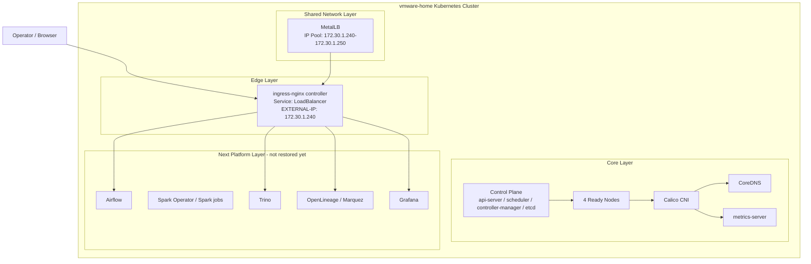
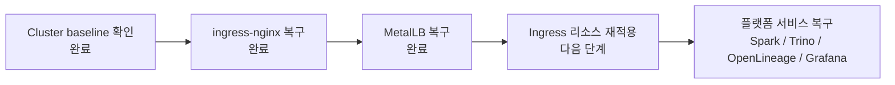

# RETrend Infra Overview

이 문서는 현재 RETrend 인프라 레이어의 **공식 현재 상태 문서**입니다.

`history/` 아래 내용은 참고용 아카이브이며, 앞으로의 인프라 진행 상황은 이 문서를 계속 갱신합니다.

## 현재 검증된 상태

- Kubernetes context: `vmware-home`
- 노드 4대(`k8s-master`, `k8s-worker1`, `k8s-worker2`, `k8s-worker3`) 모두 `Ready`
- `calico-system`, `coredns`, `metrics-server` 정상 동작
- `ingress-nginx` 설치 완료
- `ingress-nginx-controller` 파드 `Ready`
- `ingress-nginx-controller` Service 타입은 `LoadBalancer`
- `MetalLB` 복구 완료
- `ingress-nginx-controller`의 현재 `EXTERNAL-IP`는 `172.30.1.240`
- `MetalLB` 주소 풀은 `172.30.1.240-172.30.1.250`
- `etcd-k8s-master`는 현재 `Ready`이지만 재시작 누적 횟수는 높은 편이므로 다음 단계에서도 관찰 필요

## 현재 인프라 레이어

## 진행 레이어 순서

## ingress-nginx 와 MetalLB 역할

- `ingress-nginx`는 **들어온 HTTP/HTTPS 요청을 어떤 서비스로 보낼지 결정하는 문지기**입니다. 예를 들어 `trino.home.lab`로 들어온 요청을 `trino` 서비스로 보내는 식입니다.
- `MetalLB`는 **베어메탈 Kubernetes에서 LoadBalancer 서비스에 실제 외부 IP를 붙여주는 장치**입니다. 클라우드의 AWS ELB나 GCP LoadBalancer 역할을 로컬/온프렘 환경에서 대신합니다.
- 쉽게 말하면, `MetalLB`가 **집 주소(IP)** 를 만들어 주고, `ingress-nginx`가 그 주소로 들어온 요청을 보고 **어느 방(서비스)으로 보낼지** 정합니다.

## 이 단계에서 확인한 포인트

- 과거 리소스들은 `history/helm/nginx/*.yaml`, `history/infra/*/k8s/*ingress*.yaml` 기준으로 `nginx` ingress class를 사용합니다.
- 지금 설치한 컨트롤러는 `IngressClass=nginx`로 올라왔고, `MetalLB`가 `172.30.1.240`을 할당했기 때문에 외부 진입점까지 준비됐습니다.
- `00_infra/metallb/address-pool.yaml` 기준으로 `IPAddressPool`과 `L2Advertisement`를 재구성했습니다.
- 실제 수동 확인에서 `http://172.30.1.240/` 호출은 `404`를 반환했습니다. 아직 개별 Ingress 리소스를 적용하지 않았기 때문에, 이 응답은 **컨트롤러는 열려 있지만 라우팅 규칙은 아직 없음**을 뜻합니다.

## 다음 단계

다음 슬라이스는 과거 Ingress 리소스 재적용입니다. 이제 `airflow.home.lab`, `trino.home.lab`, `monitoring.home.lab` 같은 ingress 경로를 다시 연결할 준비가 됐습니다.
